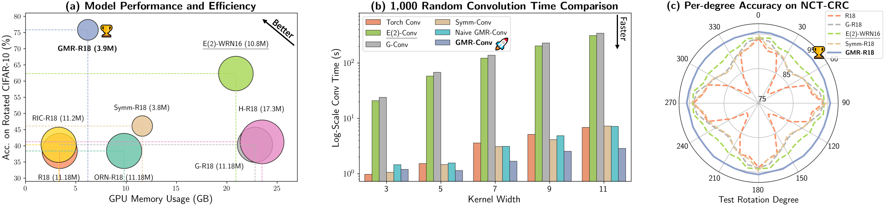

# GMR-Conv: An Efficient Rotation and Reflection Equivariant Convolution Kernel Using Gaussian Mixture Rings

[](https://pypi.org/project/GMR-Conv/) [](./LICENSE) [](https://arxiv.org/abs/2501.09753)

This is the official implementation of paper "GMR-Conv: An Efficient Rotation and Reflection Equivariant Convolution Kernel Using Gaussian Mixture Rings"

*[Yuexi Du](https://xypb.github.io/), Jiazhen Zhang, [Nicha C. Dvornek](https://www.hellonicha.com/), [John A. Onofrey](https://medicine.yale.edu/profile/john-onofrey/)*

*Yale University*



For any question related to the implementation, please open issue in this repo, we will respond to you ASAP. For other question about the paper, please contact the author directly.

## News

- **Jan. 2025** Our paper is now available on [arXiv](https://arxiv.org/abs/2501.09753)!

## Abstract

> Symmetry, where certain features remain invariant under geometric transformations, can often serve as a powerful prior in designing convolutional neural networks (CNNs). While conventional CNNs inherently support translational equivariance, extending this property to rotation and reflection has proven challenging, often forcing a compromise between equivariance, efficiency, and information loss. In this work, we introduce Gaussian Mixture Ring Convolution (GMR-Conv), an efficient convolution kernel that smooths radial symmetry using a mixture of Gaussian-weighted rings. This design mitigates discretization errors of circular kernels, thereby preserving robust rotation and reflection equivariance without incurring computational overhead. We further optimize both the space and speed efficiency of GMR-Conv via a novel parameterization and computation strategy, allowing larger kernels at an acceptable cost. Extensive experiments on seven classification and one segmentation datasets demonstrate that GMR-Conv not only matches conventional CNN’s performance but can also surpass it in applications with orientation-less data. GMR-Conv is also proven to be more robust and efficient than the state-of-the-art equivariant learning methods. Our work provides inspiring empirical evidence that carefully applied radial symmetry can alleviate the challenges of information loss, marking a promising advance in equivariant network architectures.


## Installation

We provide both the PyPI package for [GMR-Conv](https://pypi.org/project/GMR-Conv/) and the code to reproduce the experiment results in this repo.

To install and directly use the GMR-Conv, please run the following command:
```bash
pip install GMR-Conv
```

The minimal requirement for the GMR-Conv is:
```bash
"scipy>=1.9.0",
"numpy>=1.22.0",
"torch>=1.8.0"
```

**Note**: Using lower version of torch and numpy should be fine given that we didn't use any new feature in the new torch version, but we do suggest you to follow the required dependencies. If you have to use the different version of torch/numpy, you may also try to install the package from source code at [project repo](https://github.com/XYPB/GMR-Conv).

## Usage

Our GMR-Conv is implemented with the same interface as conventional torch convolutional layer. It can be used easily in any modern deep learning CNN implemented in PyTorch.

```python
import torch
from GMR_Conv import GMR_Conv2d

x = torch.randn(2, 3, 32, 32)
# create a 2D GMR-Conv of size 3x3
gmr_conv = GMR_Conv2d(3, 16, 3)
y = GMR_conv(x)
x_rot = torch.rot90(x, 1, (2, 3))
y_rot = GMR_conv(x_rot)
# check equivariance under 90-degree rotation
print(torch.allclose(torch.rot90(y, 1, (2, 3)), y_rot, atol=1e-7))
```

For more detail about the specific argument for our GMR-Conv, please refer to [here](https://github.com/XYPB/GMR-Conv/blob/458e24c61f97229cfa167c60ad03f7f2c43bb91e/src/GMR_Conv/gmr_conv.py#L40-L71).

We have also provided GMR-ResNet and GMR-ResNet3D in this repo, you may also use it as regular ResNet but with rotational equivariance.

```python
import torch
from GMR_Conv import gmr_resnet18

x = torch.randn(2, 3, 32, 32)
# use "gmr_conv_size" argument to specify kernel size at each stage.
gmr_r18 = gmr_resnet18(gmr_conv_size=[9, 9, 5, 5])
output = gmr_r18(x)
```

For general CNN implemented in PyTorch, you may use ``convert_to_GMR_conv`` function to convert it from regular CNN to equivariant CNN using ``GMR_Conv2d``.

```python
import torch
import torchvision.models.resnet as resnet
from GMR_Conv import convert_to_GMR_conv

model = resnet.resnet18()
gmr_model = convert_to_GMR_conv(model)
```


## Train & Evaluation on MedMNIST

<!-- TODO -->

## Reference

```
@article{du2025gmrconv,
      title={GMR-Conv: Symmetric Rotation Equivariant Convolution for Biomedical Image Classification}, 
      author={Du, Yuexi and Onofrey, John A and others},
      journal={arXiv preprint arXiv:2501.09753},
      year={2025},
      eprint={2501.09753},
      archivePrefix={arXiv},
      primaryClass={cs.CV},
      url={https://arxiv.org/abs/2501.09753}, 
}
```
